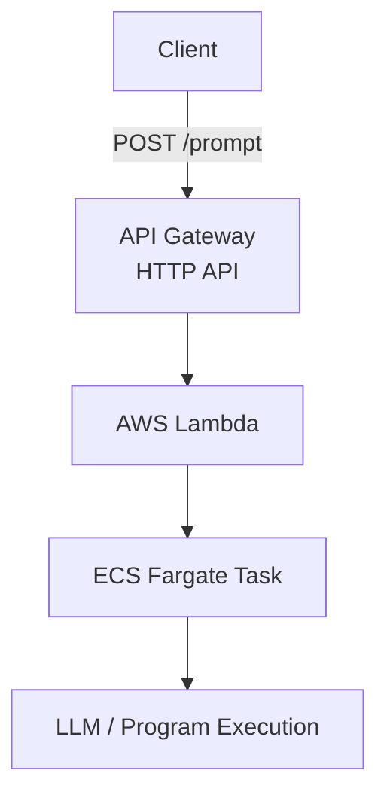

# Code interpreter with AWS ECS.
This code implements a simple LLM execution pipeline using AWS managed services.
User prompts are sent via API Gateway, processed by AWS Lambda, and executed inside an ECS Fargate container.

There are two tables in Redshift, **users** and **interactions** table. (see /input)
This LLM agent, deployed in Bedrock, is aware of the table, so it can answer anything about tables in DB, or make machine learning model.

---
## Architecture

---

## Components

### API Gateway
- HTTP API
- Endpoint: `POST /prompt`
- Accepts JSON input

Example request:
```json
{
  "prompt": "Please make a machine learning model from 'interaction' table."
}
