# Code Interpreter with AWS ECS

**LLM based python execution pipeline** built on **AWS**.  
User prompts are sent through an API endpoint, processed serverlessly, and executed inside a scalable ECS Fargate container.

---

## Overview

This project demonstrates how to:

- Accept user prompts via **API Gateway**
- Orchestrate execution with **AWS Lambda**
- Run arbitrary python code on **ECS Fargate**
- Query and reason over **Amazon Redshift** tables using an agent deployed on **Amazon Bedrock**
- Any outputs produced by the agent is saved in **s3** (see `/results`)

The agent understands the database schema and can:
- Answer analytical questions about the data
- Generate SQL queries
- Build and execute machine learning models from the tables

---

## Data Sources

There are two tables stored in **Amazon Redshift** (see `/input`):

- **`users`**
- **`interactions`**

The LLM agent is aware of these schemas and can reason over them directly.

---

## Architecture

```mermaid
flowchart TD
    Client([👤 Client]) -->|POST /prompt| APIGW[🌐 API Gateway<br/>HTTP API]
    APIGW --> Lambda[⚡ AWS Lambda<br/>Request Handler]
    Lambda --> ECS[📦 ECS Fargate Task<br/>Execution Environment]
    ECS --> LLM[🤖 LLM / Program Execution<br/>Code Interpreter]
    LLM -->|Store outputs| S3[🗄️ Amazon S3<br/>Output Storage]
    
    style Client fill:#e1f5ff
    style APIGW fill:#fff4e1
    style Lambda fill:#ffe1f5
    style ECS fill:#e1ffe1
    style LLM fill:#f5e1ff
    style S3 fill:#ffe1e1
```

---

## Components

### API Gateway
- **Type:** HTTP API
- **Endpoint:** `POST /prompt`
- **Format:** JSON

#### Example Request
```
api_gateway_url = "https://<enter-API-here>/default/mbda_python_executor"

prompt = '''
    Make a machine learning model from 'interaction' table. Use 'purchase' column for the target variable.
    '''

payload = {"prompt": prompt}
headers = {"Content-Type": "application/json"}
response = requests.post(api_gateway_url, json=payload, headers=headers)
```

---
