# 🚀 Code Interpreter with AWS ECS

A streamlined LLM execution pipeline built on AWS managed services. User prompts flow through API Gateway, get processed by Lambda, and execute inside ECS Fargate containers for secure, scalable code interpretation.

## 📊 Overview

This system connects to two Redshift tables (**users** and **interactions** - see `/input`) and deploys an LLM agent in Amazon Bedrock. The agent can:
- Query and analyze database tables
- Build machine learning models
- Execute complex data operations

---

## 🏗️ Architecture

```mermaid
flowchart TD
    Client([👤 Client]) -->|POST /prompt| APIGW[🌐 API Gateway<br/>HTTP API]
    APIGW --> Lambda[⚡ AWS Lambda<br/>Request Handler]
    Lambda --> ECS[📦 ECS Fargate Task<br/>Execution Environment]
    ECS --> LLM[🤖 LLM / Program Execution<br/>Code Interpreter]
    
    style Client fill:#e1f5ff
    style APIGW fill:#fff4e1
    style Lambda fill:#ffe1f5
    style ECS fill:#e1ffe1
    style LLM fill:#f5e1ff
```


---

## 🔧 Components

### API Gateway
- **Type:** HTTP API
- **Endpoint:** `POST /prompt`
- **Format:** JSON

#### Example Request
```json
{
  "prompt": "Please make a machine learning model from 'interaction' table."
}
```

### AWS Lambda
Handler function that orchestrates the execution pipeline and manages ECS task invocation.

### ECS Fargate
Containerized execution environment providing isolated, scalable compute for code interpretation and LLM operations.

### Amazon Bedrock
Hosts the LLM agent with awareness of the Redshift schema, enabling intelligent query generation and data analysis.

---


<div align="center">
Built with ☁️ AWS | Powered by 🤖 LLM
</div>
