# 🚀 Code Interpreter with AWS ECS

A lightweight **LLM execution pipeline** built entirely on **AWS managed services**.  
User prompts are sent through an API endpoint, processed serverlessly, and executed inside a scalable ECS Fargate container.

---

## ✨ Overview

This project demonstrates how to:

- Accept user prompts via **API Gateway**
- Orchestrate execution with **AWS Lambda**
- Run arbitrary code or LLM-based tasks on **ECS Fargate**
- Query and reason over **Amazon Redshift** tables using an LLM deployed on **Amazon Bedrock**

The LLM understands the database schema and can:
- Answer analytical questions about the data
- Generate SQL queries
- Build and execute machine learning models from the tables

---

## 🗄️ Data Sources

There are two tables stored in **Amazon Redshift** (see `/input`):

- **`users`**
- **`interactions`**

The LLM agent is aware of these schemas and can reason over them directly.

---

## 🧩 Architecture

```mermaid
flowchart TD
    Client([👤 Client]) -->|POST /prompt| APIGW[🌐 API GatewayHTTP API]
    APIGW --> Lambda[⚡ AWS LambdaRequest Handler]
    Lambda --> ECS[📦 ECS Fargate TaskExecution Environment]
    ECS --> LLM[🤖 LLM / Program ExecutionCode Interpreter]
    
    style Client fill:#e1f5ff
    style APIGW fill:#fff4e1
    style Lambda fill:#ffe1f5
    style ECS fill:#e1ffe1
    style LLM fill:#f5e1ff
```

---

## 🔧 Components

### API Gateway
- **Type:** HTTP API
- **Endpoint:** `POST /prompt`
- **Format:** JSON

#### Example Request
```json
{
  "prompt": "Please make a machine learning model from 'interaction' table."
}
```

### AWS Lambda
Handler function that orchestrates the execution pipeline and manages ECS task invocation.

### ECS Fargate
Containerized execution environment providing isolated, scalable compute for code interpretation and LLM operations.

### Amazon Bedrock
Hosts the LLM agent with awareness of the Redshift schema, enabling intelligent query generation and data analysis.

---
